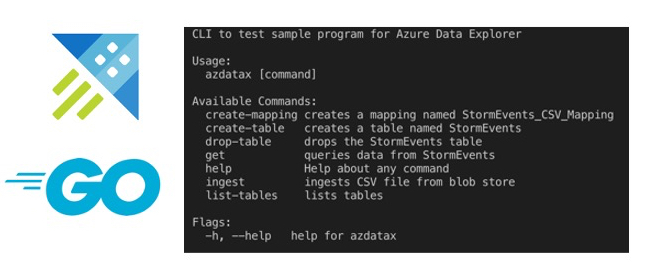

# Getting started with the Go SDK for Azure Data Explorer

Learn how to use the [Azure Data explorer Go SDK](https://docs.microsoft.com/azure/data-explorer/kusto/api/golang/kusto-golang-client-library?WT.mc_id=devto-blog-abhishgu) to ingest data from a [Azure Blob storage](https://docs.microsoft.com/azure/storage/blobs/storage-blobs-introduction?WT.mc_id=devto-blog-abhishgu) container and query it programmatically using the SDK. After a quick overview of how to setup Azure Data Explorer cluster (and a database), we will walk through the code to understand what's going on and finally test the application using a simple CLI interface

## What is Azure Data Explorer ?

[Azure Data Explorer](https://docs.microsoft.com/azure/data-explorer/?WT.mc_id=devto-blog-abhishgu) (also known as **Kusto**) is a fast and scalable data exploration service for analyzing large volumes of diverse data from any data source, such as websites, applications, IoT devices, and more. This data can then be used for diagnostics, monitoring, reporting, machine learning, and additional analytics capabilities.

Azure Data Explorer supports [several ingestion methods](https://docs.microsoft.com/azure/data-explorer/ingest-data-overview?WT.mc_id=devto-blog-abhishgu), including connectors to common services like [Event Hub](https://docs.microsoft.com/azure/data-explorer/ingest-data-event-hub?WT.mc_id=devto-blog-abhishgu), programmatic ingestion using SDKs, such as [.NET](https://docs.microsoft.com/azure/data-explorer/net-sdk-ingest-data?WT.mc_id=devto-blog-abhishgu) and [Python](https://docs.microsoft.com/azure/data-explorer/python-ingest-data?WT.mc_id=devto-blog-abhishgu), and direct access to the engine for exploration purposes. It also integrates with analytics and modeling services for additional analysis and visualization of data using tools such as [Power BI](https://docs.microsoft.com/azure/data-explorer/power-bi-best-practices?WT.mc_id=devto-blog-abhishgu)

